import { LinkCard } from '@astrojs/starlight/components';

:::tip[Sommaire]
- Météo: Raréfaction des pluies sur la pays
- Hydrologie: Légère hausse du plan d’eau sur le Sénégal
- Situation phytosanitaire: Infestations de la chenille poilue, de la chenille légionnaire d’automne, de larve de Lema planifrons et de sauteriaux au Centre
- Situation pastorale: Faible disponibilité de fourrage sur le territoire excepté le Sud et le Sud Est
- Suivi de la végétation: Installation timide du tapis herbacé au Nord et au Centre du pays.
:::

<LinkCard
	title="Télécharger Documents"
	description="Décade du 01 au 10 Aout 2023"
	href="https://www.anacim.sn/IMG/pdf/bulletin_dec1_aout_2023.pdf"
	target="_blanc"
/>

## Situation météorologique

### Situation pluviométrique

Cette décade à été marquée par la raréfaction des pluies sur le pays.
Au Nord: seule la région de Matam a été concernée par les activités pluvio orageuses durant la journée du 06 avec 93.0mm à Ranérou, 22.0mm à Semmé et 32.7mm à Kanel.

A l’Ouest, c’est l’onde du 06 au 07 août qui a occasionné des pluies faibles à modérées au niveau de quelques localités de la région de Thiès et Dakar (2.0mm à Dakar, 13.0mm à Thiès, 26.6mm à Thiadiaye, 66.1mm à Mbour).
Ces pluies bien que mal réparties dans l’espace, ont été salvatrices pour les cultures souffrant d’un stress hydrique.

Au Centre: durant les journées du 06 et 07 les quantités reçues ont été plus importantes par endroits et les cumuls décadaires ont varié entre 0.5mm à Foundiougne et 55.6mm à Guinguinéo. Plusieurs localités, après une pause de presque dix jours ont reçu des précipitations quasi insignifiantes. Cette situation pourrait impacter sur le bon développement des cultures.

L’Est a été moins pluvieuse par rapport aux décades précédentes avec seulement 3 journées de pluie (80.9mm à Fongolimbi, 57.1mm à Kédougou, 57.0mm à Saraya....).

Le Sud du pays continue de recevoir régulièrement des quantités plus ou moins importantes surtout pendant les 6 premiers jours de la décade. Le cumul décadaire y a varié entre 5.0mm à Médina Yoro Foula et 145.4mm au Cap Skirring.

Le cumul saisonnier varie entre 50.5mm à Mérina Dakhar et 553.9mm à Kolda. Des poches déficitaires sont notées à l’Ouest et au Centre (Kébémer, Dakar, Tivaouane, Méouane, Mérina Dakhar, Bambey, Niakhar, Gossas, Malem Hodar, Koungheul); au Sud (Oussouye, Tendouk, Bignona, Ziguinchor, Goudomp, Sédhiou, Salémata). Partout ailleurs la situation est normale à excédentaire.

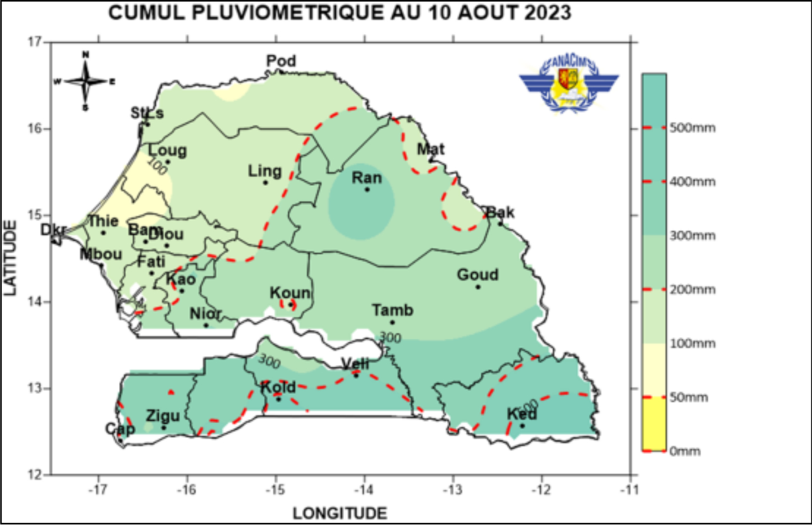

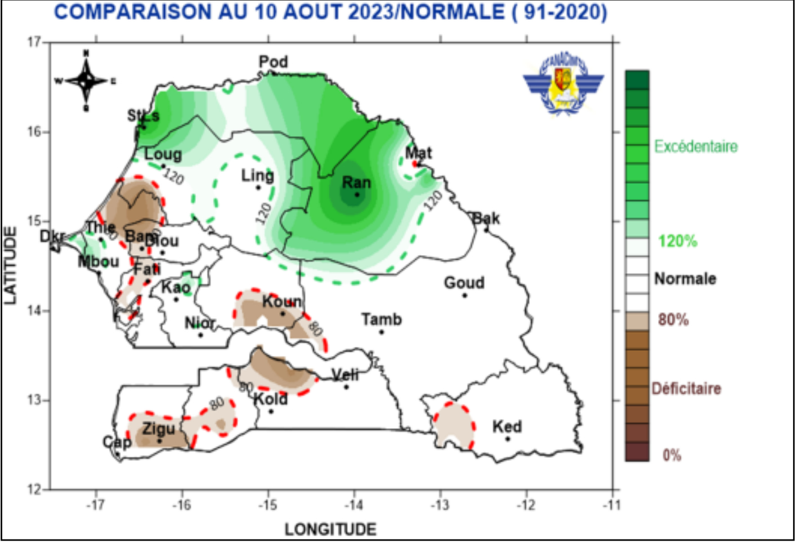

### Perspectives pour la deuxième décade d’Aout 2023

La deuxième décade d'aout sera particulièrement humide sur tout le pays. Des systèmes pluvio-orageux marqués se succèderont régulièrement sur l'ensemble du territoire durant toute la seconde décade d’aout. Les pluies seront plus conséquentes (fortes intensités) entre la Casamance, le Nord-est (Matam, Linguère) et le Centre-ouest (Fatick, Kaolack, Thiès et Dakar) du territoire.

## Situation hydrologique

### Station de Bakel

A la station hydrométrique de Bakel, la situation se présente comme suit: le plan d’eau est passé de 390 le 1er à 436 cm le 10
Août. La tendance est à la hausse de 46 cm. Sur la même période, le niveau actuel du fleuve à Bakel est en deçà (145 cm) de son niveau de l’année hydrologique dernière (2022-2023). Comparé aux années hydrologiques de la plus forte et faible hydraulicité, le niveau est respectivement largement inférieur de 207 et
supérieure 44 cm en moyenne.

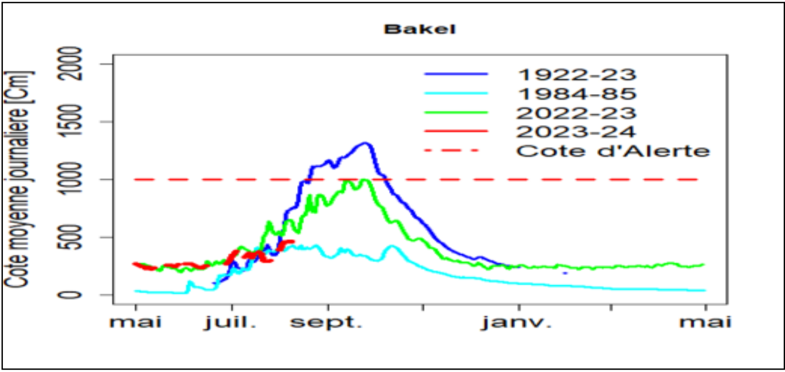

### Station de Matam

A la station hydrométrique de Matam, la situation se présente comme suit: le niveau d’eau est passé de 384 cm le 1er Août à 424 cm le 10 Août. La tendance est à la hausse de 40 cm. Le niveau actuel du fleuve à la même période est inférieur à 136 cm par rapport à celui de l’année hydrologique précédente (2022-2023). Comparé aux années hydrologiques de la plus forte et faible hydraulicité il est respectivement inférieur de 171 cm et supérieur de 38 cm en moyenne.

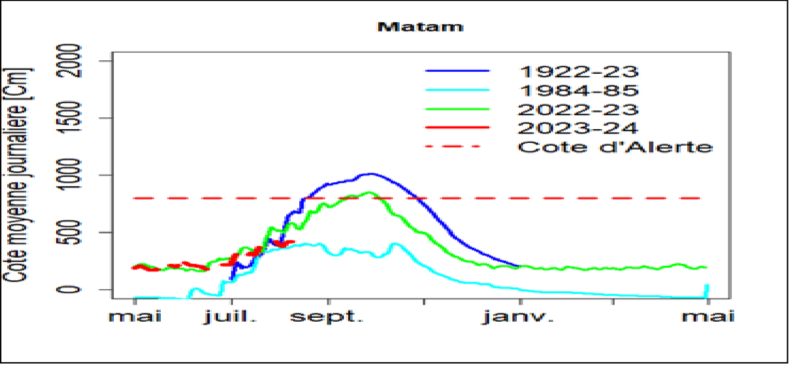

### Station de Podor

A la première décade d’août, la situation se présente comme suit:
Le niveau de l’eau est passé de 322 cm le 1er à 315 cm le 10 Août. La tendance est à la baisse de 7 cm. La comparaison du niveau de l’eau de cette année avec celui de l’année passée sur la même
période montre une baisse de 136 cm en moyenne. Par rapport aux années de forte et de faible hydraulicité, le niveau de cette
année est respectivement inférieur 135 cm et supérieur de 48 cm en moyenne.

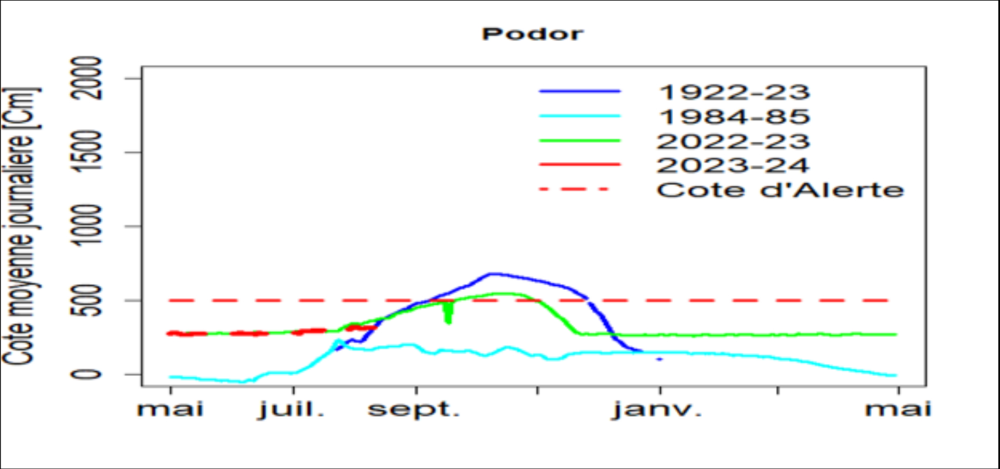

### Station de Falémé à Kidira

La situation hydrologique de la Falémé à la station de Kidira se présente comme suit: le niveau de l’eau est passé de 268 cm le 1er
à 272 cm le 10 Août; La tendance est à une légère hausse de 4cm. Ce niveau actuel est en deçà de 65 cm de celui de l’année dernière sur la même décade. Le niveau de la plus faible hydraulicité (1984-1985) de la Falémé est supérieur de 70 cm en moyenne.

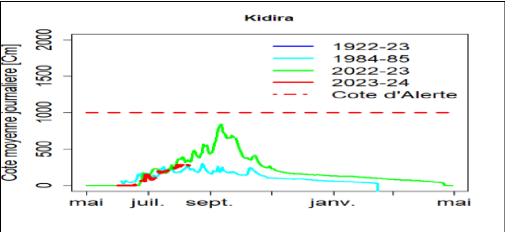

### Conclusion

La situation hydrologique dans le bassin du Fleuve Sénégal est marquée par: une alternance entre une phase de baisse et une phase de hausse du HE, mais dans l’ensemble la tendance est à la hausse dans les bassins versants de la Gambie et du Sénégal à l’exception de la station de Podor.

## Situation phytosanitaire

La situation phytosanitaire est principalement marquée par des infestations de la chenille poilue, de la chenille légionnaire d’au-
tomne, de larve de Lema planifrons et de sauteriaux principalement dans les régions de Louga, Thiès, Kaffrine, Kaolack, Fatick,
Diourbel et Tambacounda. Ces infestations sont notées sur le niébé, le mil, le maïs et l’arachide. Des traitements phytosanitaires sont effectués par les équipes de la DPV à l’aide des Unité
de Protection des Végétaux (UPV) et par les Comités de Lutte Villageois (CLV) à l’aide de pulvérisateurs manuels. Ailleurs la situation est relativement calme.

### La chenille poilue : Amsacta moloneyi

Des infestations de Amsacta moloneyi (larves L1, L3 et L4) sur le niébé et l’arachide sont notées dans certaines localités des régions de Louga, Kaffrine, Kaolack, Fatick et Thiès. La chenille légionnaire d’automne : Spodoptera frugiperda
Suite à des séries de prospection réalisées, des infestations de la chenille légionnaire d’automne (CLA) : Spodoptera frugiperda
aux stades larvaires (L1, L2 et L3) ont été notées dans certaines localités du département de Tambacounda (Dialocoto, Diop counda, Dialocoto Malicounda, Magama, Damantang, Seino, Saroudia) du département de Nioro (Taïba Niassene, Medina
Sabah) et du département de Foundioune (Thioyenen niombato) occasionnant des dégâts considérables sur le maïs au stade plantule, montaison et épiaison.

Superficie prospectée : 145ha

Superficie infestée :47ha

Superficie traitée : 25ha

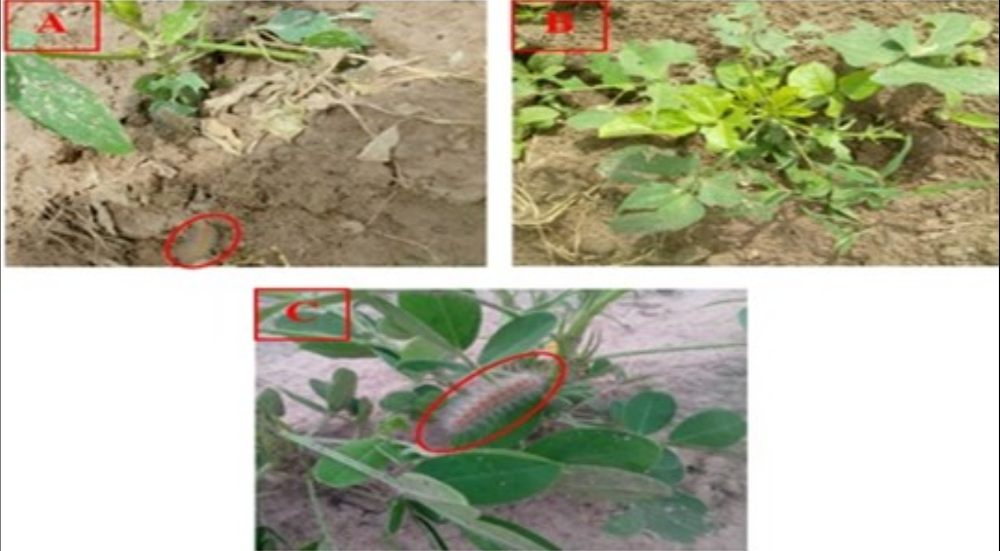

### Lema planifrons

Il a été noté dans le département de Koungheul précisément dans la localité de Mbadianène, la présence de larve de Lema planifrons sur le mil avec une densité de 04 individus par plant infesté.

Superficie infestée :60ha

Superficie traitée : 60ha

### Sauteriaux

Des infestations de Oedaleus senegalensis (OSE) sont notées dans le département de Kaffrine et de Diourbel entrainant des
défoliations sur l’arachide (plantule) et le niébé. Des traitements phytosanitaires par UPV ont été effectués sur les 100 ha infestés
avec 50L du Chlorpyriphos-éthyl 480 UL (0,5L/ha). 105 ha ont été prospectés au totale.

### Autres zones

Excepté les sauteriaux, la CLA, la chenille poilue et les larves de Lema planifrons aucune infestation n’a été signalée au niveau des autres zones agro-écologiques toujours sous contrôle.

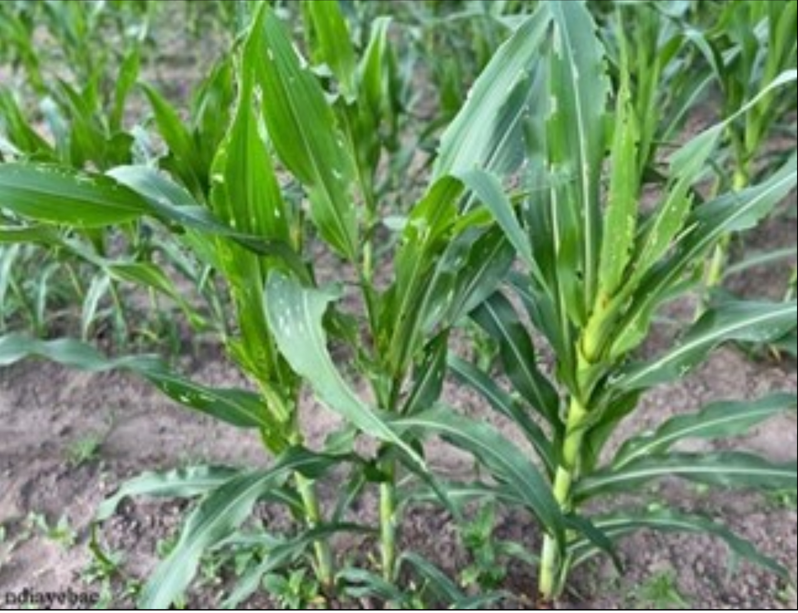

## Situation pastorale

### La Situation alimentaire, l’état du cheptel et des pâturages

Les pâturages sont constitués d’un mélange de jeunes pousses d’herbes et de paille de brousse dont la qualité et la quantité sont
très variables entre les régions de Matam, Louga et Kaffrine. En effet, actuellement dans les départements de Malem kaffrine, Birkilane et Koungheul, le couvert végétal est moyennement fourni en
paille de brousse avec des disparités éco-géographiques conséquentes et une quantité nutritive très faible. Dans vallée du fleuve
Sénégal, avec l’abondance de la crue de cette année, les cultures de décrue sont pratiquées dans de vastes espaces avec une bonne
prédisposition de pâturages post récoltes. La paille de riz issue de la récolte de la saison hivernale est fortement convoitée par les
animaux. Les réserves fourragères dans le département de Dagana sont de plus en plus rares. En lieu et place, les résidus de récolte
tels que les feuilles de patate douce sont utilisées chez les petits ruminants. La ferme Téranga produit de la luzerne tandis que la
ferme West Africa Farm (WAF) produit du mil fourrager et du Maral falfa. Pour la production de la ferme WAF, une partie de la pro-
duction est cédé aux acteurs locaux dans la responsabilité sociétale d’entreprise.

### Abreuvement du bétail

La disponibilité des ressources en eau reste toujours bonne avec le début de remplissage des mares. L’abreuvement du cheptel se fait
au niveau des mares ce qui réduit considérablement l’affluence au niveau des forages et puits pastoraux. L’abreuvement du cheptel
de la vallée du fleuve Sénégal se fait au niveau du fleuve et ses défluents.

### Etat d’embonpoint du cheptel

L’état d’embonpoint des animaux se dégrade de plus en plus avec la faible disponibilité des ressources fourragères en quantité
et qualité, sauf dans le sud et sud-est du pays.

### Mouvement du bétail

La quasi-totalité des transhumants est revenue dans leurs zones de départ. Les mouvements commerciaux internes sont marqués
par des sorties d’animaux (bovins, ovins, caprins) de la région de Matam en direction des grands centres urbains comme Dakar,
Touba, Saint-Louis, Mbour.

### Situation zoo-sanitaire

Les Chefs des Services régionaux de l’Elevage et des Productions animales de Ziguinchor, Saint-Louis, Kolda, Kaffrine, Thiès, Fatick
Tambacounda, Kédougou et Sédhiou ont rapporté des suspicions de : 

- i) botulisme chez les espèces bovine, caprine, équine et ovine
- ii) clavelée, 
- iii) cysticercose bovine,
- iv) dermatophilose bovine,
- v) dermatose nodulaire contagieuse bovine,
- vi) distomatose chez les espèces bovine et ovine,
- vii) échinococcose bovine,
- viii) ecthyma contagieux chez les espèces caprine et ovine,
- iv) entérotoxémie, fièvre aphteuse, gale chez les espèces caprine, équine et ovine, gourme équine, maladie de Gumboro,
- x) maladie de Newcastle,
- xi) parvovirose canine,
- xii) pasteurellose chez les espèces bovine,
- xiii) caprine et ovine,
- xiv) peste des petits ruminants,
- xv)peste porcine africaine,
- xvi) tétanos chez les espèces équine et ovine.

## Suivi de la végétation

### 1. Indice de Végétation (NDVI : Normalized Difference Vegetation Index )

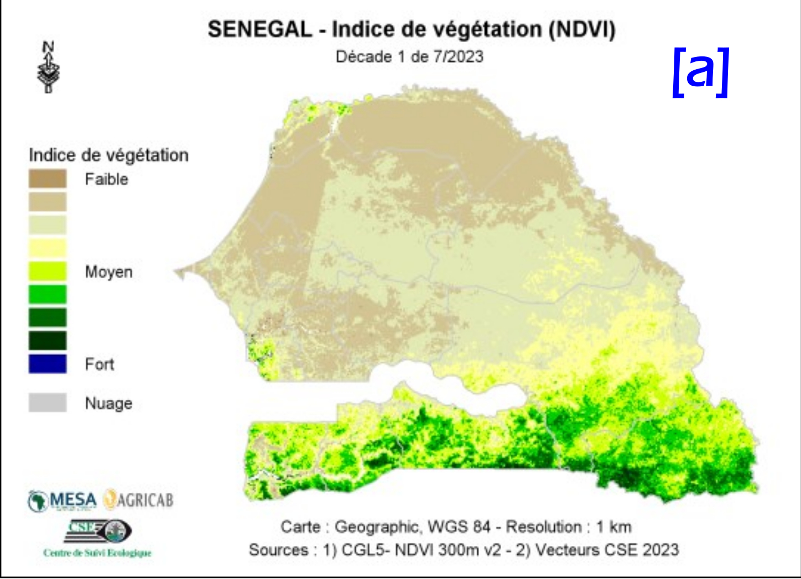

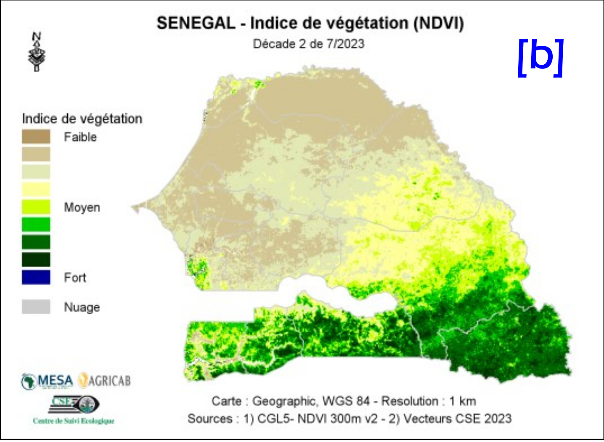

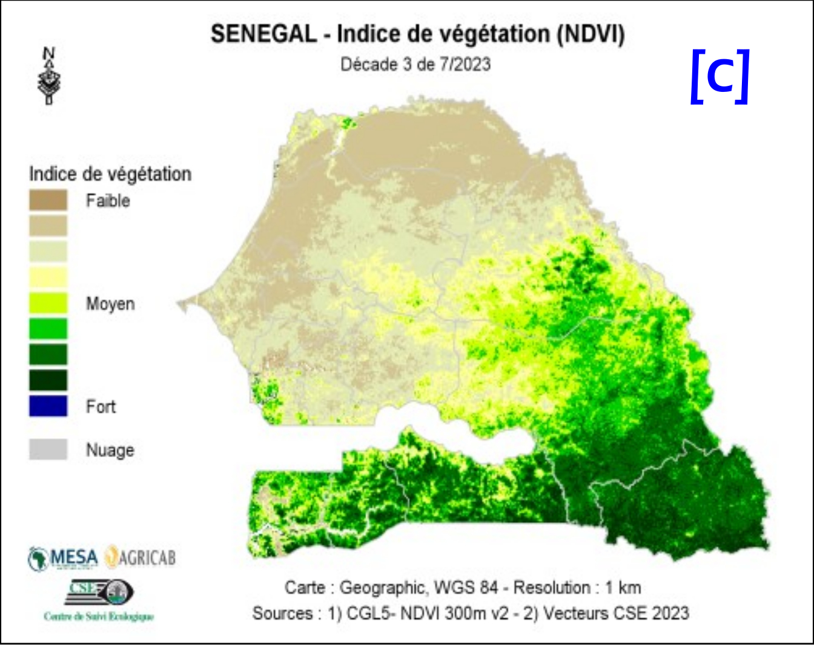

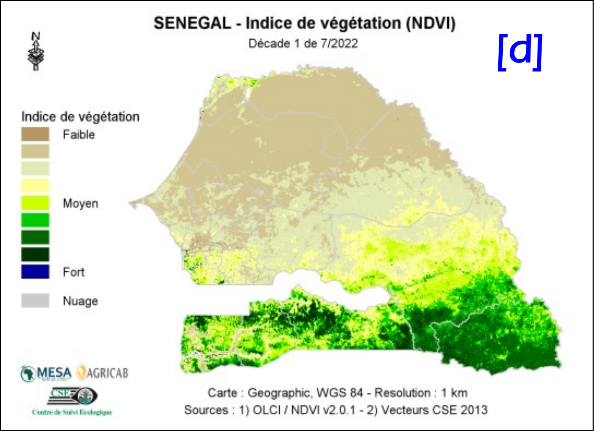

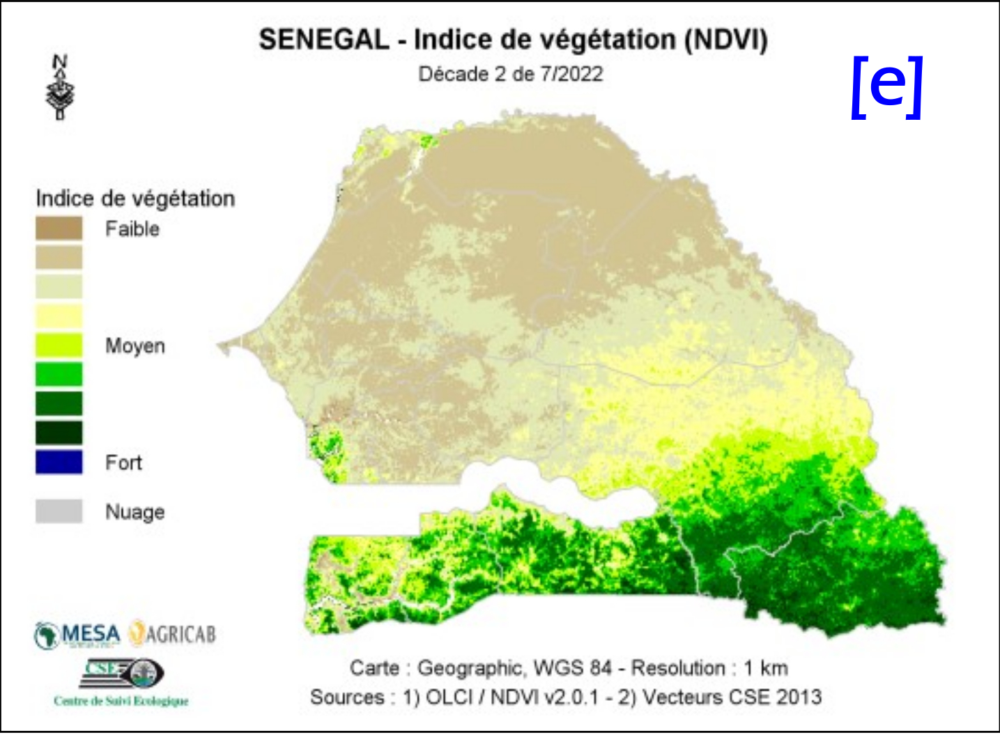

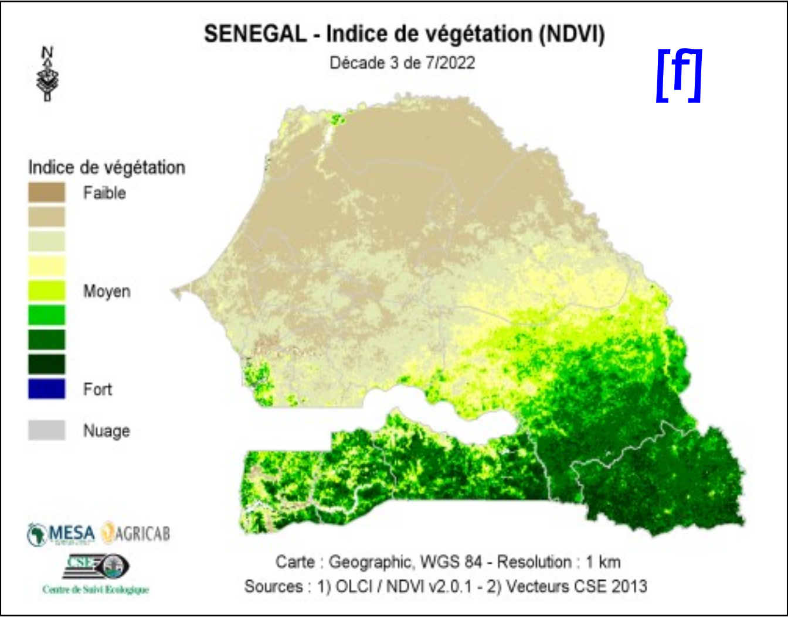

*Figure 1 : Cartes du NDVI de (a) la première décade, (b) la deuxième décade et (c) la troisième décade du mois de juillet 2023 en comparai-
son avec les valeurs de l’année 2022 aux mêmes décades (d), (e) et (f), respectivement.*

A la troisième décade du mois de juillet 2023, la végétation s’est bien
installée dans la partie sud et sud-est du territoire national avec des va-
leurs du NDVI moyennes à élevées (Figures 1a, 1b et 1c). Cependant,
l’installation se poursuit timidement au nord et centre du pays avec des
valeurs du NDVI qui sont faibles à moyennes. Les valeurs du NDVI de
l’année 2023 sont plus élevées que celles de l’année précédente à la
même période (Figures 1d, 1e et 1f).

### 2. Start of Season (SoS)

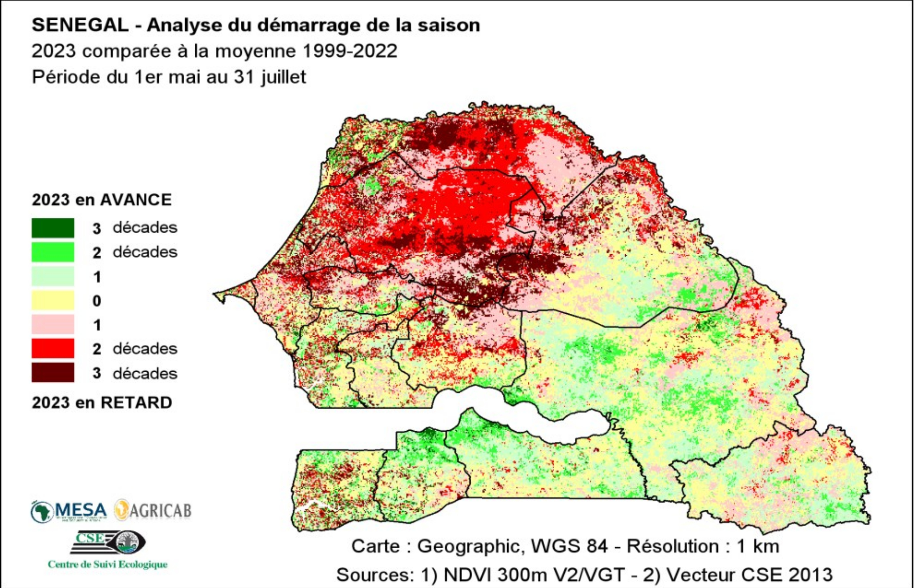

*Figure 2: Analyse du démarrage de la croissance de la végétation 2023*

Le démarrage de la croissance de la végétation a été normal à précoce au sud, sud-est et sur une partie du centre-sud du
pays. Toutefois, des retards de démarrage de deux à trois décades de la croissance sont principalement observés dans la
Vallée du Fleuve, la Zone Sylvopastorale et sur le Littoral (Figure 2).

## Situation des marchés

### I – Niveau approvisionnement des marchés

Les offres des produits locaux secs sont faibles dans les marchés ruraux de collecte et dans ceux urbains. Cette
situation est liée à la phase transitoire caractérisée par l’épuisement des stocks des produits de la campagne agri-
cole précédente, à l’installation de la soudure et à l’occupation des paysans dans les travaux champêtres de la
campagne agricole 2023/2024. Ainsi, l’approvisionnement est constitué faiblement de céréales locales sèches (mil, sorgho, maïs), de légumes de
grande consommation (oignon et pomme de terre) et majoritairement de riz et maïs importé.
Les marchés à bétail ont été moins dynamiques au courant de cette décade avec des offres et une demande en animaux moins importante qu’au décade précédent et à des prix toujours élevés.

### II – Analyse comparative des prix 

#### Céréales locales sèches

les prix moyens de détail s’affichent comme suit : 448F CFA/kg (mil souna), 438 F CFA/
kg (sorgho), 368 F CFA/kg (maïs). La comparaison annuelle indique une hausse légère pour le mil de (16%), des
baisses pour le sorgho et le maïs de (- 4%). Les variations quinquennales sont plus importantes avec de fortes
hausses de : mil (+ 79%), sorgho (+52%) et maïs (+55%).
Le prix du riz local décortiqué qui s’élève à 405 F CFA/kg est en hausse de 4% et 31%, respectivement par rapport à
ses valeurs annuelle et quinquennale.

#### Céréales importées

Les prix des céréales importées qui s’affichent à : 358 F CFA/kg (riz brisé importé non parfu-
mé), 520 F CFA/kg (riz brisé importé parfumé), 342 F
CFA/kg (maïs) restent élevés. Les comparaisons indiquent
de faibles variations annuelles pour le riz non parfumé
(+1%), pour le riz parfumé (+9%) et pour le maïs (- 9%). Les
variations quinquennales sont en hausse de : riz non par-
fumé (+17%), riz parfumé (+20%) et maïs (+37%).

#### Légumineuses

les prix de détail des produits de rente se situent à : 1085 F CFA (niébé), 502 F CFA (arachide
coque), 1087 F CFA (arachide décortiquée). La comparaison annuelle indique une hausse légère de 11% (arachide
décortiquée) et des baisses de 5% (arachide coque) et de 3% (niébé). La comparaison quinquennale indique de
fortes hausses de : +50% (arachide coque), +59% (arachide décortiquée) et de +47% (niébé).

#### Légumes
Les prix moyens régionaux ont oscillé majoritairement dans les fourchettes suivantes : « 700 – 1000 » F
CFA/kg (oignon local), « 750 – 1000 » F CFA/kg (pomme de terre local), soit des prix moyens respectifs de 896 F
CFA/kg, 805 F CFA/kg. Les variations annuelles sont de +74% (oignon local) et +27% (pomme de terre local). La
comparaison quinquennale indique des hausses fortes de 139% (oignon local) et de 65% (pomme de terre local).

#### Bétail

les prix des sujets présentés ont oscillé dans les fourchettes suivantes : «275 000 – 450 000 » F CFA/tête pour
les bovins, « 85 000 – 132 500 » F CFA/tête pour les ovins, « 35 000 – 45 000 » F CFA/tête pour les caprins, soit des
prix moyens respectifs par tête de : 355 152 F CFA, 115 000 F CFA, 40 250 F CFA. La comparaison par rapport aux
périodes de référence montre de faibles variations annuelles de (+3%) chez les bovins, (- 8%) les ovins et (+8)
chez les caprins. La comparaison quinquennale indique aussi des hausses moyennes pour les bovins (+34%), les
ovins (+22%) et les caprins (+19%).

### III – Perspectives

La deuxième décade du mois d’aout 2023 serait marquée par des offres faibles dans les marchés ruraux de collecte et des stocks faibles dans les marchés urbains pour les produits locaux secs. L’affluence dans les marchés ruraux devrait s’affaiblir avec l’épuisement des
stocks des producteurs. Conséquemment, les prix des produits agricoles locaux (céréales sèches, légumineuses) vont
poursuivre leurs tendances de hausse saisonnière. Cependant on pourrait observer sur le marché les premier récoltes en vert du maïs dans certaines zones.

## Recommandations générales

:::danger[Recommandations]
- Lever le gel des importations des légumes de grande consommation (oignon, pomme de terre) pour atténuer la tension sur les marchés.
- Renforcer la surveillance épidémiologique, promouvoir la culture fourragère;
- Encourager les populations à s’informer sur les prévisions météorologiques pour la planification des opérations culturales;
:::